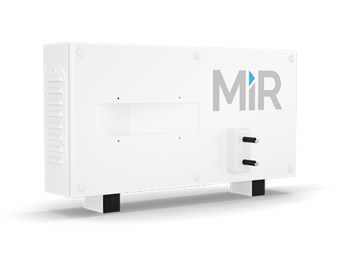

# Estación de carga
Acompañado del MiR se provee una estación de carga para el vehículo, se sugiere ubicar en un lugar frecuentado por el robot como la recepción por ejemplo para así cargarlo mientras no esté en uso y por ende pueda garantizar un periodo de servicio más prolongado. La estación de carga soportada por el proyecto es la MiR Charge 24V, sin embargo esta puede cambiar de acuerdo con las necesidades del cliente, en caso de que así sea por favor contactar con uno de los miembros del equipo asignado para la instalación del robot.

La estación se ubica en el lugar escogido por el cliente y se conecta de manera tradicional con la electricidad