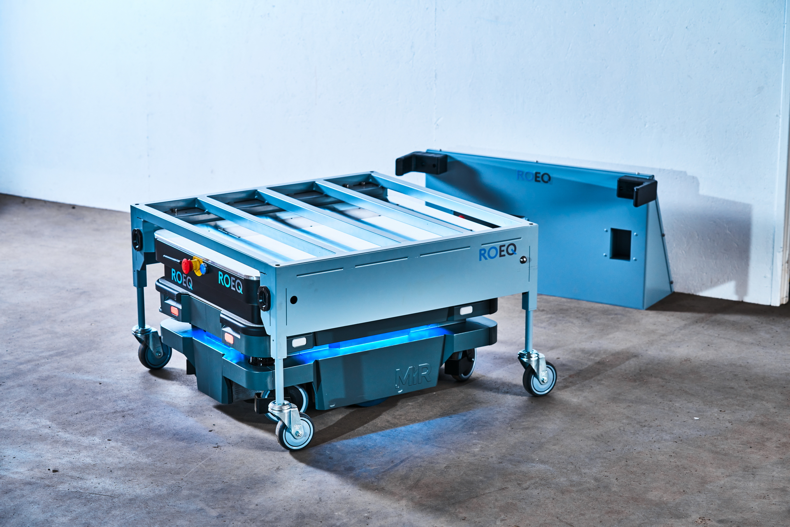
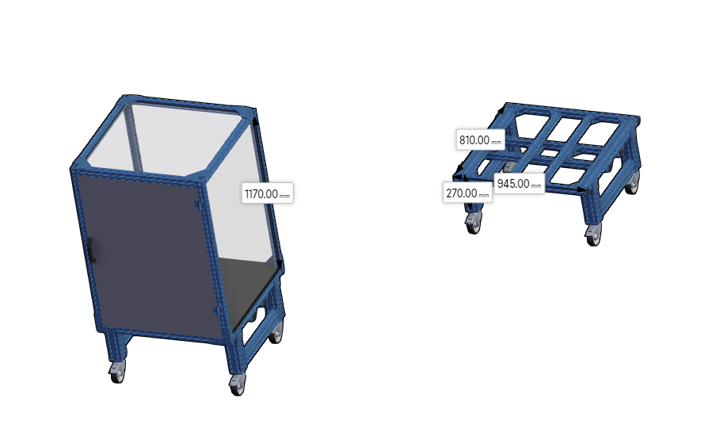

# Módulo superior

La implementación de este proyecto consiste en usar al carro autónomo MiR 200 como base de transporte de un módulo superior el cual servirá para poder almacenar las maletas e iniciar con su transporte.

Este módulo superior está soportado en principio por el accesorio TMC300  de ROEQ, El cual es una plataforma que permitirá conectar el vehículo con el resto del módulo, esto se logra de manera automática.

El siguiente paso de esto es conectar el vehículo y el accesorio con el módulo de carga Cart 300 de ROEQ, el cual  es la plataforma con las ruedas aparte del carro como se puede apreciar en la figura.

Sobre este Accesorio de carga se instalarán las cabinas que albergarán las maletas.

En resumen el módulo superior está conformado por 3 elementos esenciales, el TCM300 de ROEQ para anclar el carro, Cart 300 de ROEQ para soportar la cabina y desplazarla, cabinas de transporte para albergar las maletas.

