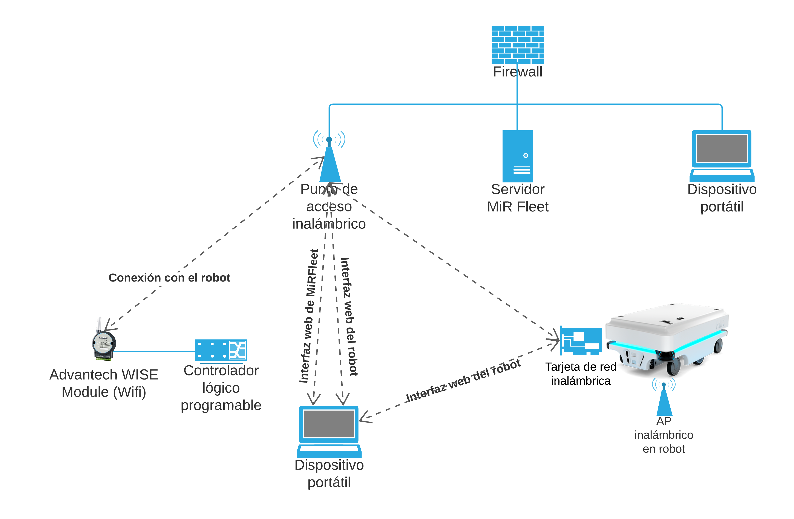

# Arquitectura de Red

Los robots MiR requieren una conexión de red estable y constante para funcionar. Una conexión inestable puede llevar a que las misiones y los recursos no se asignen a los robots, lo que provoca bloqueos y robots inactivos.

### Requerimientos

* Ancho de banda mínimo de 1 Mb por robot con una latencia máxima de 150 ms. La red debe monitorearse a lo largo del tiempo para ver cómo se ve afectado el ancho de banda durante las horas normales de trabajo.
* Intensidad de la señal no inferior a -75 dBm y una relación señal / ruido de 20 dB medida desde la perspectiva del robot. Si tiene problemas, la intensidad de la señal se puede medir con instrumentos especializados. Cualquier empresa consultora de redes podrá ayudar con esto.
* Cobertura total de la señal WiFi en todo el recorrido del robot.
* La itinerancia ocurre en el momento correcto y sin errores de autenticación. Asegúrese de que los puntos de acceso a la red de la empresa estén controlados por el mismo controlador.
* Puntos de acceso configurados para comunicarse y compartir información sobre roaming.

### Puntos de Acceso Inalámbrico

Los robots de MiR cuentan con una tarjeta de red inalámbrica y un punto de acceso inalámbrico, lo que les permite recibir señales WiFi doble banda a/b/g/n/ac. Entonces, es necesario que haya una señal de buena calidad a través de todo el recorrido en el hotel. Para esto, se deben **incluir puntos de acceso inalámbrico distribuidos según la especificación del modelo escogido**.


La antena incluida en los robots tiene poca ganancia. Si se experiencia algún problema, considere cambiarla por una antena de mayor ganancia que se ajuste a su red. 


### Ascensores

La configuración de ascensores es vista más a fondo en la siguiente sección.



