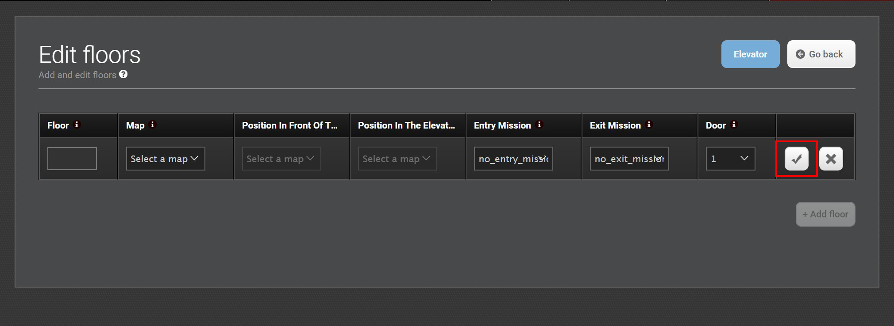

# Ascensores

Los ascensores deben controlarse mediante un PLC que tenga su propia dirección IP, que esté conectado a un módulo WISE para trabajar con robots MiR o que se pueda controlar a través de un servidor OPC UA. En ascensores más modernos es posible comunicarse a través de su REST API.


Si es necesario, contacte a su distribuidor para más información.


### Registro del Ascensor

Una vez configurado el controlador del ascensor y su dirección IP, se debe registrar en MiR Fleet, así:

1. Ir a `Fleet > Elevators` y seleccione `Create elevator`.
2. Nombre el ascensor, ingresa su dirección IP, selecciona el driver que usa, e indica si el robot debe girar dentro del ascensor. Cuando termines, selecciona `Create elevator`.

### Asignación de Pisos

Una vez registrado el ascensor, siga los siguientes pasos:

1. Seleccione `Floors` para configurar los pisos del ascensor.
2. Seleccione `+ Add floor` para agregar un piso nuevo y modificar la configuración. Las posiciones y misiones deben haberse configurado previamente en el editor de mapas \(`Setup > Maps > Create map / Edit map`\).

   * `Floor`: Número del piso.
   * `Map` : El mapa debe haber sido creado en un robot e incluir una posición de ascensor que permitirá el cambio de un mapa a otro.
   * `Position in front of elevator`: La posición de entrada del elevador frente al elevador donde el robot espera a que llegue el ascensor y se abra la puerta.
   * `Position in elevator`: La posición del elevador que representa la posición del robot. dentro del ascensor.
   * `Entry mission (opcional)`: La misión que hace el robot una vez entra al ascensor. Un ejemplo de una misión de entrada podría ser un sonido cuando el robot entra en el ascensor. Una misión de entrada debe incluir una acción de movimiento \(`Move action`\) con una posición variable.
   * `Exit mission (opcional)`: Un ejemplo de una misión de salida podría ser un sonido cuando el robot sale del ascensor.
   * `Door`: Si tiene un ascensor con dos puertas, seleccione cuál de las puertas se abre en el piso seleccionado. Si el ascensor tiene solo una puerta, seleccione 1.

   Seleccione el símbolo de verificación una vez terminado.

Una vez añadidos los pisos, active el ascensor con la palanca: 

