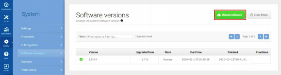

# Actualización del software

El software del robot MiR 200 se actualiza constantemente, para solucionar
errores, mejorar las funcionalidades existentes e introducir nuevas funciones. 
Para realizar la actualización se debe tener un archivo con la última
actualización el cual es proporcionado por el distribuidor MiR. Los pasos para realizar
la actualización son:

* Conectar el ordenador a la red WiFI del robot e iniciar sesión con un usuario administrador
* Ir a la sección de Sistema - Versiones de coftware - Cargar software
* Localizar el paquete de software descargado y seleccionarlo
* Luego de ser cargado el software, apagar y encender de nuevo el robot

