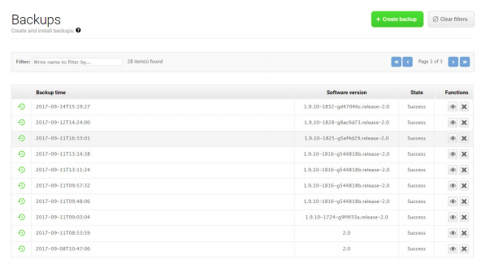

# Realizar copias de seguridad

Las copias de seguridad son importantes si más adelante se quiere
reestablecer el sistema en un momento dado, con los ajustes y misiones
actuales, esta copia de seguridad se recomienda realizar antes de 
actualizar el software o un cambio importante en las ubicaciones. 

En la sección de Backups se pueden crear, editar y eliminar copias de seguridad. 

