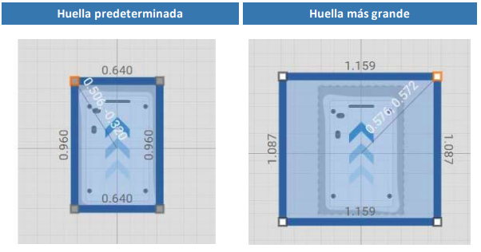

# Huella

La huella es muy importante ya que es donde se configura el espacio que va ocupar el robot incluyendo el módulo superior y las maletas, como en este caso específico el robot va tener un módulo superior se debe definir dos huellas diferentes para que el robot circule de forma adecuada.

Para cambiar la huella del robot en una misión, se utiliza la acción de ajustar huella, para el caso en que una maleta se salga del módulo superior.

