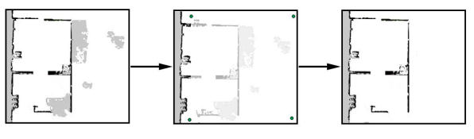

# Mapas y zonas

Los mapas son la base para que el robot navegue de forma segura y eficiente, es donde se muestra el área física en la que funciona el robot. Por cada piso del hotel se debe tener un mapa, por lo que es muy importante que estos sean robustos y confiables.

Para la configuración de los mapas se deben tener en cuenta los siguientes aspectos:

* Si un piso es muy grande, se puede dividir en mapas más pequeños, eso se sabrá si el robot tarda mucho en planificar las rutas o si se generan errores de cpu.
* La recomendación es que los mapas no sean mayores a 300x300 metros
* Para las transiciones entre pisos a través de ascensores se deben hacer uso del software MiR Fleet
* En caso de haber rampas, se debe hacer la configuración a través de las transiciones del software MiR

## Crear mapas

En caso de no tener planos en autocad, se puede conducir el robot por el cada piso del hotel para que sus sensores detecten el lugar y creen el mapa respectivo, los cual se define como mapeo. El robot automáticamente detecta los obstáculos físicos, como paredes. Posteriormente se debe editar el mapa para retirar los objetos que no deban permanecer en el mapa.

Para la creación de cada mapa se recomienda:

* Retirar obstáculos dinámicos
* Todas las puertas por donde el robot vaya a pasar deben estar abiertas
* No mapear un espacio muy abierto
* No atascar el robot en muros u objetos
* Mapear con un patrón circular al rededor del perímetro de cada piso
* En los pasillos largos dejar que el robot se quede en su sitio durante 5 minutos antes de recorrerlo
* Siempre ir por detrás del robot al hacer el mapeo
* Acabar en el mismo lugar que se empezó el mapeo

## Limpiar mapas

Para que el robot opere correctamente el mapa debe tener poco ruido \(lo que hace referencia a datos originados por elementos que generan interferencias como objetos físicos\), por lo que se puede editar el mapa con la opción de Eliminar datos cargados o registrados para limpiar los muros al rededor de objetos dinámicos.

## Agregar zonas al mapa

Para un tráfico correcto del robot se deben configurar zonas para optimizar los recorridos y el comportamiento del robot. A continuación se listan algunas zonas a tener en cuenta:

* **Escalares descendentes:** Los sensores no detectan escaleras descendentes, por lo que se deben configurar como zonas prohibidas en el mapa
* **Accesorios colgantes:** Este tipo de accesorios pueden estar fuera del alcance el robot por lo que se deben configurar como zonas prohibidas
* **Áreas altamente dinámicas:** Estas áreas en el hotel específicamente podrían ser por donde transiten muchas personas, por lo que se deben marcar como zonas no preferidas
* **Puertas:** Si las puertas son muy estrechas, el robot no pasa automáticamente, por lo que se deben configurar como zonas críticas, para que el robot cree una ruta a través de la puerta
* **Cristal:** Se recomienda que en las ventanas o puertas de cristal se pueden marcar como un muro para ayudar a la localización del robot

