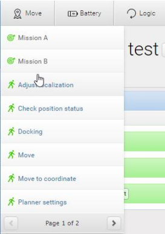

# Misiones

El robot funciona a partir de misiones, las cuales están formadas por acciones de movimiento, de lógica, de anclaje y sonidos que pueden ser agrupados para formar una misión con las acciones que sean necesarias. En todas las misiones se tienen parámetros configurables como la posición a la que debe ir el robot, que también se pueden definir a partir de variables lo que permite a un operador escoger el valor del parámetro como el número de la habitación a la que el robot se debe dirigir.

Para crear misiones eficientes se debe tener en cuenta lo siguiente:

* ¿Qué tareas ejecutará el robot?
* ¿Qué acciones forman parte de esa tarea y en qué orden?
* ¿Qué diferencias hay entra las tareas?

Además, se deben revisar todos los posibles resultados de las misiones e indicarle que hacer en caso de un error, para lo que se utiliza la misión Try/Catch, donde en el catch se definen las acciones que se deben realizar en caso de un error.

Para el hotel específicamente, se debe crear una misión principal, donde se marquen las habitaciones como variable posición de destino, para que cuando se opere, simplemente se ejecute la misión y se indique el número de habitación y así el robot se dirija automáticamente con las maletas a la habitación indicada.

