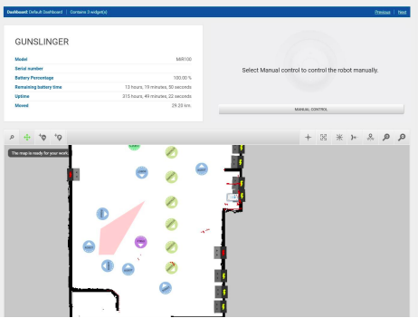

# Paneles de mando

Para que los usuarios operen del software del robot de manera fácil
y sencilla, se debe crear para cada grupo de usuario un panel de mando
con las opciones para controlar el robot. Un panel está formado
por widgets que representan una función del sistema, como
la misión principal de ir a las habitaciones. 

Para el hotel específicamente, se debe configurar
un panel de mando para cada grupo de usuario. 
