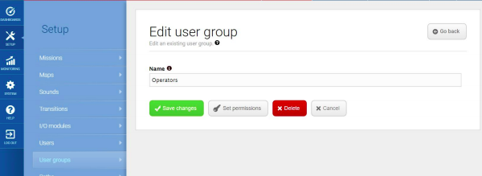
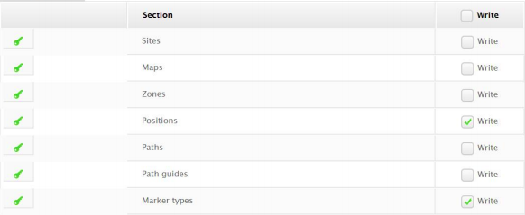
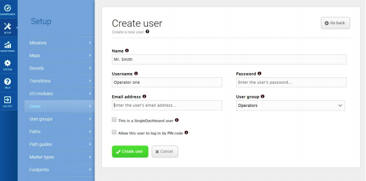

# Usuarios y grupos de usuario

Todos los usuarios que manipulan el robot deben tener un perfil de usuario que son administrados en la sección de Usuarios, donde se pueden configurar, editar y eliminar. Para el robot en el hotel se deben configurar tres grupos de usuario, integrador, administrador y operador. El integrador puede bloquear partes del sistema para otro grupo de usuario.

## Crear grupos de usuario

Se realiza en la sección de Configuración - Grupos de usuarios, donde se pueda crear grupos con acceso a distintas partes del software del robot.

En la opción de Ajustar permisos se pueden ocultar partes de la interfaz a un grupo específico de usuarios.

## Crear usuarios

En la sección de Configuración - Usuarios se pueden crear nuevos usuarios y configurar a que grupo de usuarios pertenecen y asignar un pin de cuatro dígitos para el ingreso.

